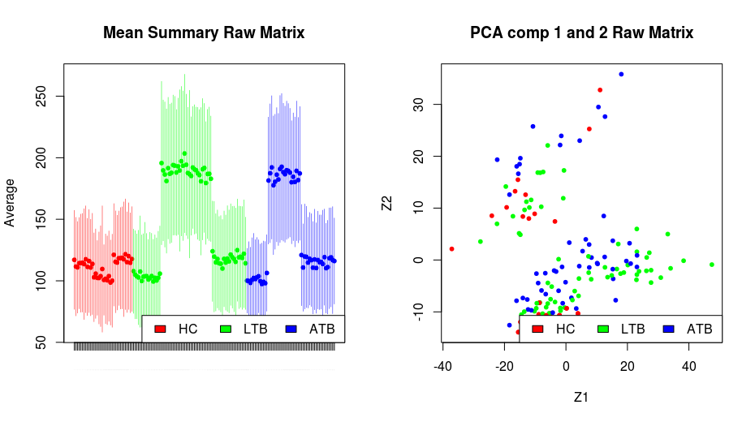
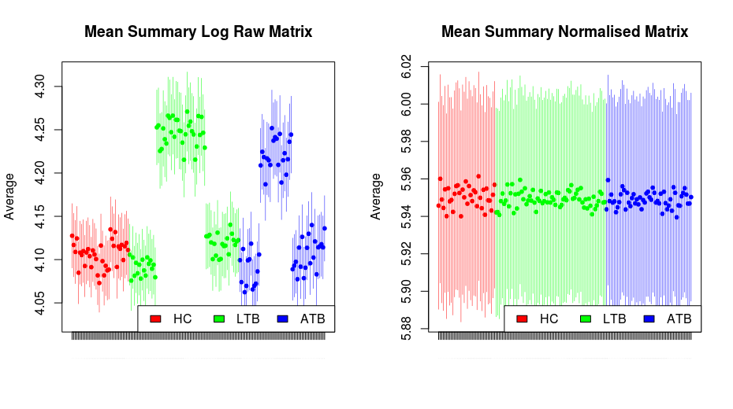
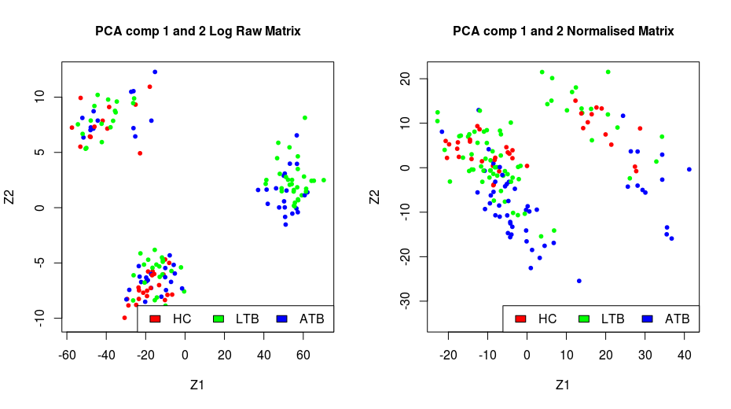
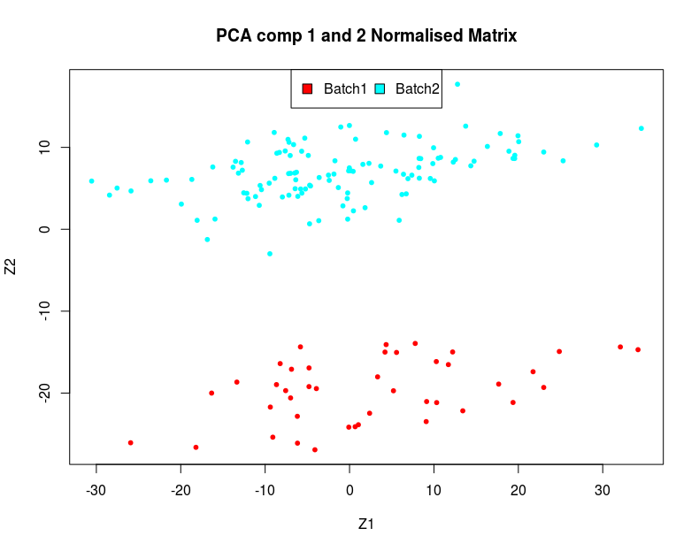

# GSE19491
## Blood Transcriptional Profiles in Human Active and Latent Tuberculosis.

Visit the [entry](https://www.ncbi.nlm.nih.gov/geo/query/acc.cgi?acc=GSE19491) for this dataset as NCBI to familiarise yourself with this study. 

## Downloading the data
We can either download the data using *R*, but it may be quicker to do this manually. Scroll to the bottom of the NCBI page for this dataset and find the entry for **Series Matrix Files** [link](ftp://ftp.ncbi.nlm.nih.gov/geo/series/GSE19nnn/GSE19491/matrix/GSE19491_series_matrix.txt.gz).  

Download the data and save it in the subdirectory (create one if it is not present) called dataExternal. 

## Loading data into R  
Open the R script titled 02_generateTestData.R. The first few lines of the script are comments, loading libraries for the analysis, setting working directories and declaring functions to be used later in the script.  
```R
# Name: 02_generateTestData.R
# Auth: umar.niazi@kcl.ac.uk
# Date: 25/04/2018
# Desc: generate test data

### libraries to load
library(GEOquery)
library(Biobase)
library(lumi)
library(lumiHumanAll.db)
library(lumiHumanIDMapping)
library(annotate)
library(downloader)

setwd('biomarkers/')
dir.create('dataExternal')

f_lGetPCAClusterCount = function(pr.out){
# see script for details ...
}
```
Some of these libraries (also called Packages) require the use of the Bioconductor suite of libraries. To install those correctly follow the instructions [here](https://www.bioconductor.org/install/) (however you may not need to install these now as your machine for this tutorial should have them pre-installed).  

We will load the data matrix as an [expression set object](https://www.bioconductor.org/packages/3.7/bioc/vignettes/Biobase/inst/doc/ExpressionSetIntroduction.pdf) using the function *getGEO*, add gene names [(probe annotations)](https://www.bioconductor.org/packages/release/bioc/html/lumi.html) and check the meta data that is associated with this matrix. These probe annotations and data normalisation steps will depend on the type of platform (e.g. Illumina Microarray, RNA-Seq, Affymetrix Microarray etc.) used to generate the data.  


```R
oExp = getGEO(filename = 'dataExternal/GSE19491_series_matrix.txt.gz')
# add lumi nuIDs - converting probe ids to identify genes
oExp = addNuID2lumi(oExp, lib.mapping = 'lumiHumanIDMapping' )

# remove any NA data
i = which(is.na(rowSums(exprs(oExp))))
oExp = oExp[-i,]

## load and examine the metadata
df = pData(oExp)
```  
If you look at the metadata, you will see a lot of information related to this study and experiment. We will look at a few columns of interest that represent the disease status.  
```R
> df[1:5, 7:10]
          channel_count                  source_name_ch1 organism_ch1                      characteristics_ch1
GSM484368             1 Whole blood from healthy control Homo sapiens age: 28years, when baseline sample taken
GSM484369             1 Whole blood from healthy control Homo sapiens age: 21years, when baseline sample taken
GSM484370             1 Whole blood from healthy control Homo sapiens age: 49years, when baseline sample taken
GSM484371             1 Whole blood from healthy control Homo sapiens age: 41years, when baseline sample taken
GSM484372             1 Whole blood from healthy control Homo sapiens age: 33years, when baseline sample taken

> # examine the types of samples
> as.data.frame(table(oExp$source_name_ch1))
                                                                                                         Var1 Freq
1                                                                             CD4+ cells from healthy control    4
2                                                                      CD4+ cells from patient with Active TB    7
3                                                                             CD8+ cells from healthy control    4
4                                                                      CD8+ cells from patient with Active TB    7
5                                                                                           Human whole blood  274
6                                                                              Monocytes from healthy control    4
7                                                                       Monocytes from patient with Active TB    7
8                                                                            Neutrophils from healthy control    4
9                                                                     Neutrophils from patient with Active TB    7
10                                                                           Whole blood from healthy control   12
11                                                                           Whole Blood from healthy control   24
12                                                                    Whole Blood from patient with Active TB   54
13 Whole blood from patient with active TB 12 months after treatment started (i.e. after treatment completed)    7
14                                   Whole blood from patient with active TB 2 months after treatment started    7
15                                                   Whole blood from patient with active TB before treatment    7
16                                                                    Whole Blood from patient with Latent TB   69
> as.data.frame(table(oExp$characteristics_ch1.3))
                               Var1 Freq
1             healthy control: ASLE   17
2             healthy control: pSLE   19
3            healthy control: Still   22
4  healthy control: Strep and Staph   23
5                     illness: ASLE   28
6                  illness: Control   12
7           illness: Control (BCG-)    6
8           illness: Control (BCG+)   34
9                   illness: Latent   38
10               illness: LATENT TB   31
11                    illness: PSLE   82
12                     illness: PTB  103
13                   illness: Staph   40
14                   illness: Still   31
15                   illness: Strep   12
```
We will subset the whole blood data and proceed with creating short names for the factors i.e. Controls (HC), Latent TB (LTB), Active TB (ATB).  
```R
# get the whole blood data
i = grep('^Whole blood from healthy control$|^Whole Blood from patient with Active TB$|^Whole Blood from patient with Latent TB$', 
         x = oExp$source_name_ch1, ignore.case = T, perl = T)
oExp = oExp[,i]

### .....
> table(fSamples)
fSamples
 HC LTB ATB 
 36  69  54 
> levels(fSamples)
[1] "HC"  "LTB" "ATB"
```

If you attended the section on clustering and data quality checks then the next few steps should be familiar. We will use the *R* class *CDiagnosticPlots* to perform some quality checks on this data. Our aim here is to see if these samples are comparable and if there are any possible batch effects.  


```R
#### examine the data matrix
url = 'https://raw.githubusercontent.com/uhkniazi/CDiagnosticPlots/master/CDiagnosticPlots.R'
download(url, 'CDiagnosticPlots.R')

# load the required packages
source('CDiagnosticPlots.R')
# delete the file after source
unlink('CDiagnosticPlots.R')

mData = exprs(oExp)
range(mData)
## [1]   -38.95207 62858.36000
dim(mData)
## [1] 48790   159
# no need to perform cluster analysis on 48K Probes, reduce matrix size by
# taking a random sample 
i = sample(1:nrow(mData), 2000, replace = F)
mData = mData[i,]
# create a diagnostics object
oDiag.1 = CDiagnosticPlots(mData, 'Raw Matrix')
fBatch = df$fSamples
par(mfrow=c(1,2))
plot.mean.summary(oDiag.1, fBatch, axis.label.cex = 0.01)
plot.PCA(oDiag.1, fBatch, csLabels = '')
```
Figure 1 shows the raw data without any normalisations or transformations.  

  
**Figure 1:** The left hand plot shows the average expression level in each sample with the standard error for the mean. The right hand plot shows the first two components from the principal component plot. All samples are coloured according to the disease status i.e. Controls (HC), Latent TB (LTB) and Active TB (ATB). The data suggests that there are two possible batches present in the data.  
  
Before we normalise the data we shift it along the real number line to remove any negative values before log transforming to avoid creating undefined values. We can then transform the data and normalise it.   

```R
#################################### data normalization
# remove negative values first and set minimum value to 1
exprs(oExp) = exprs(oExp) + abs(min(exprs(oExp))) + 1

## Raw data log transformed
oDiag.1 = CDiagnosticPlots(mData, 'Log Raw Matrix')

# normalize and log2 transform the data using lumi
oExp.lumi = lumiT(oExp, 'log2')
## data normalization
oExp = lumiN(oExp.lumi, method='rsn')

# log2 transformed and normalised data
oDiag.2 = CDiagnosticPlots(mData, 'Normalised Matrix')
```
The next figure shows comparisons between data only log transformed and data log transformed and normalised. One sample stands out in the principal component plots, you can choose to drop it or keep it in the analysis. We will keep all the samples in this analysis.  

 
  
**Figure 2:** **_a_** The top 2 panels show comparisons of the average expression level in each sample with standard error for the mean. The Samples with all three groups HC, LTB and ATB appear to be comparable after normalisation. **_b_** The bottom 2 panels show the comparisons of the principal component plots (with the first 2 components plotted). The samples form three clusters before normalisation and 2 clusters after normalisation. 

Figure 2 b suggests that there may be a batch effect in the data which can not be corrected by normalisation. We can assign a batch label to each cluster (Figure 3).  

 
**Figure 3:** PCA performed on the normalised matrix and coloured on the Batch.  

Looking at the meta data, we can find explore and hopefully find a reason for this artifact, this appears to be due to using different RNA extraction kits.  

```R
f = as.character(oExp$extract_protocol_ch1)
f[grepl('PerfectPure', df$extract_protocol_ch1)] = 'PerfectPure'
f[!grepl('PerfectPure', df$extract_protocol_ch1)] = 'MagMAX'

table(oExp$fBatch, f)
        f
         MagMAX PerfectPure
  Batch1      0          42
  Batch2    117           0

table(oExp$fBatch, oExp$fSamples)
        
         HC LTB ATB
  Batch1 12  17  13
  Batch2 24  52  41
```


This data set can not be saved along with the Batch information to be used as a test data set after we train a classifier using the training data. We will select the the genes, that are common with the pre-selected genes in the training set and save the results in the **results** folder. If you have not managed to finish the analysis upto this step, then look in the results folder for the file _lData.test.rds_.


