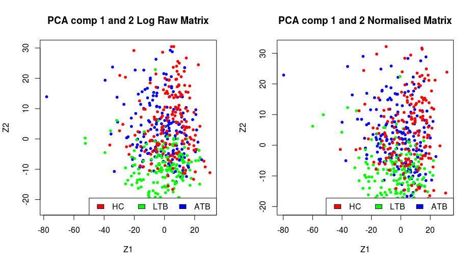

# GSE37250
## Genome-wide transcriptional profiling of HIV positive and negative adults with active tuberculosis, latent TB infection and other diseases.

Visit the [entry](https://www.ncbi.nlm.nih.gov/geo/query/acc.cgi?acc=GSE37250) for this dataset as NCBI to familiarise yourself this study. 

## Downloading the data
We can either download the data using *R*, but it may be quicker to do this manually. Scroll to the bottom of the NCBI page for this dataset and find the entry for **Series Matrix Files** [link](ftp://ftp.ncbi.nlm.nih.gov/geo/series/GSE37nnn/GSE37250/matrix/).  

Download the data and save it in the subdirectory (create one if it is not present) called dataExternal. 

## Loading data into R  
Open the R script titled 01_generateTrainingData.R. The first few lines of the script are comments, loading libraries for the analysis and setting working directories.  
```R
# Name: generateTrainingData.R
# Auth: umar.niazi@kcl.ac.uk
# Date: 23/04/2018
# Desc: generate test data

### libraries to load
library(GEOquery)
library(Biobase)
library(lumi)
library(lumiHumanAll.db)
library(lumiHumanIDMapping)
library(annotate)
library(limma)
library(downloader)

setwd('biomarkers/')
dir.create('dataExternal')
```
Some of these libraries (also called Packages) require the use of the Bioconductor suite of libraries. To install those correctly follow the instructions [here](https://www.bioconductor.org/install/) (however you may not need to install these now as your machine for this tutorial should have them pre-installed).  

We will load the data matrix as an [expression set object](https://www.bioconductor.org/packages/3.7/bioc/vignettes/Biobase/inst/doc/ExpressionSetIntroduction.pdf) using the function *getGEO*, add gene names [(probe annotations)](https://www.bioconductor.org/packages/release/bioc/html/lumi.html) and check the meta data that is associated with this matrix. These probe annotations and data normalisation steps will depend on the type of platform (e.g. Illumina Microarray, RNA-Seq, Affymetrix Microarray etc.) used to generate the data.  
```R
oExp = getGEO(filename = 'dataExternal/GSE37250_series_matrix.txt.gz')
## ignore the warning as it is a bug
# add lumi nuIDs - converting probe ids to identify genes
oExp = addNuID2lumi(oExp, lib.mapping = 'lumiHumanIDMapping' )

## check the metadata
df = pData(oExp)
str(df)
head(df)
```  
If you look at the metadata, you will see a lot of information related to this study and experiment. We will look at a few columns of interest that represent the disease status.  
```R
> df[1:5, 1:3]
                                                         title geo_accession                status
GSM914353 active tuberculosis HIV negative Malawi WB_1_M_39619     GSM914353 Public on Oct 23 2013
GSM914354 active tuberculosis HIV negative Malawi WB_1_M_39668     GSM914354 Public on Oct 23 2013
GSM914355 active tuberculosis HIV negative Malawi WB_1_M_39827     GSM914355 Public on Oct 23 2013
GSM914356 active tuberculosis HIV negative Malawi WB_1_M_39896     GSM914356 Public on Oct 23 2013
GSM914357 active tuberculosis HIV negative Malawi WB_1_M_39956     GSM914357 Public on Oct 23 2013

> ## the main grouping of interest and control variable
> xtabs(~ df$characteristics_ch1 + df$characteristics_ch1.1)
                                    df$characteristics_ch1.1
df$characteristics_ch1               hiv status: HIV negative hiv status: HIV positive
  disease state: active tuberculosis                       97                       98
  disease state: latent TB infection                       83                       84
  disease state: other disease                             83                       92
```
We can see that in this cohort most of the subjects are of African descent and are classed as Active TB, Latent TB and Other disease; and they are either HIV+ or HIV-. We will create some short names for these variables before further analysis.  
```R
 HC LTB ATB 
175 167 195 

HIV- HIV+ 
 263  274 
```
If you attended the section on clustering and data quality checks then the next few steps should be straightforward. We will use the *R* class *CDiagnosticPlots* to perform some quality checks on this data. Our aim here is to see if these samples are comparable and if there are any possible batch effects.  
```R
#### examine the data matrix
url = 'https://raw.githubusercontent.com/uhkniazi/CDiagnosticPlots/master/CDiagnosticPlots.R'
download(url, 'CDiagnosticPlots.R')

# load the required packages
source('CDiagnosticPlots.R')
# delete the file after source
unlink('CDiagnosticPlots.R')

mData = exprs(oExp)
range(mData)
## [1]   -72.59169 57967.29000
dim(mData)
## [1] 47323   537
# no need to perform cluster analysis on 47K Probes, reduce matrix size by
# taking a random sample 
i = sample(1:nrow(mData), 2000, replace = F)
mData = mData[i,]
# create a diagnostics object
oDiag.1 = CDiagnosticPlots(mData, 'Raw Matrix')
fBatch = df$fSamples
par(mfrow=c(1,2))
plot.mean.summary(oDiag.1, fBatch, axis.label.cex = 0.01)
plot.PCA(oDiag.1, fBatch, csLabels = '')
```
Figure 1 shows the raw data without any normalisations or transformations.  

  
**Figure 1:** The left hand plot shows the average expression level in each sample with the standard error for the mean. The right hand plot shows the first two components from the principal component plot. All samples are coloured according to the disease status i.e. Controls (HC), Latent TB (LTB) and Active TB (ATB).  
  
Before we normalise the data we shift it along the real number line to remove any negative values before log transforming to avoid creating undefined values. We can then transform the data and normalise it.   

```R
#################################### data normalization
# remove negative values first and set minimum value to 1
exprs(oExp) = exprs(oExp) + abs(min(exprs(oExp))) + 1

## Raw data log transformed
oDiag.1 = CDiagnosticPlots(mData, 'Log Raw Matrix')

# normalize and log2 transform the data using lumi
oExp.lumi = lumiT(oExp, 'log2')
## data normalization
oExp = lumiN(oExp.lumi, method='rsn')

# log2 transformed and normalised data
oDiag.2 = CDiagnosticPlots(mData, 'Normalised Matrix')
```
The next figure shows comparisons between data only log transformed and data log transformed and normalised. One sample stands out in the principal component plots, you can choose to drop it or keep it in the analysis. We will keep all the samples in this analysis.  

 
  
**Figure 2:** **_a_** The top 2 panels show comparisons of the average expression level in each sample with standard error for the mean. The Samples with all three groups HC, LTB and ATB appear to be comparable. **_b_** The bottom 2 panels show the comparisons of the principal component plots (with the first 2 components plotted). 

Our objective eventually is to find a diagnostic biomarker that can differentiate between ATB and the other two groups. Hence we will combine both the HC and LTB groups together into a single group marked **Other** before proceeding with further analysis.  

To find a biomarker here, we also need to reduce the number of variables, before embarking on using Machine Learning (Statistical Learning) methods. We use a multistep approach here.
```R
## Check if a gene is annotated, if not then we will drop it from the analysis
mDat = exprs(oExp)
# get annotation
df = select(lumiHumanAll.db, keys = rownames(mDat), columns=c('ENTREZID', 'SYMBOL', 'GENENAME'), keytype = 'PROBEID')
## drop columns with NA i.e. no annotations
df = na.omit(df)
## drop columns with duplicate genes, multiple probes mapping to same gene
i = duplicated(df$SYMBOL)
table(i)
## i
## FALSE  TRUE 
## 20773 10611 
df = df[!i, ]
head(df)
              PROBEID ENTREZID  SYMBOL                                           GENENAME
1  97viJ90hzUX_rZ.nvY     1915  EEF1A1 eukaryotic translation elongation factor 1 alpha 1
2  9fQSYRUddRf4Z6p6T4     2597   GAPDH           glyceraldehyde-3-phosphate dehydrogenase
4  60abGV06oA3Va4f0rU     9906 SLC35E2                 solute carrier family 35 member E2
7  fZRGweI51.AwJv7v0I     6234   RPS28                              ribosomal protein S28
8  9EIpq4KI64KL0R57lo     9670   IPO13                                        importin 13
11 WZVqnU_8Kaead7ae9I    60312   AFAP1                actin filament associated protein 1
```
The next step for reducing the number of Genes is to drop those genes that do not show a difference in average expression levels between the groups Other and ATB. 
```R
##### perform DE analysis
## first merge the groups LTB and HC 
fSamples = as.character(oExp$fSamples)
fSamples[fSamples != 'ATB'] = 'Other'
fSamples = factor(fSamples, levels = c('Other', 'ATB'))

# model design matrix, adjusting for HIV status
design = model.matrix(~ fSamples + oExp$fHIV)

# fit linear models
fit = lmFit(mDat, design)
fit = eBayes(fit)

# get the results for ATB vs Others (where others is baseline)
dfLimmma = topTable(fit, coef=2, adjust='BH', number = Inf)
head(dfLimmma)
            logFC   AveExpr        t      P.Value    adj.P.Val         B
GBP6    1.2976387  7.770680 17.74263 7.969099e-56 1.655421e-51 115.68428
SEPT4   1.7485141  8.889084 17.65005 2.254695e-55 2.341839e-51 114.66297
BATF2   1.4111605  8.141314 15.62027 1.186961e-45 8.218916e-42  92.67527
DUSP3   0.6797193 12.056564 15.52228 3.415872e-45 1.773948e-41  91.63675
VAMP5   0.8553110 11.828854 15.40268 1.237029e-44 5.139363e-41  90.37243
ANKRD22 1.6571019  9.204547 15.30871 3.390860e-44 1.173972e-40  89.38171
```
We will select the top 2000 genes, sorted on adjusted P.Values - and save the results in the **results** folder. If you have not managed to finish the analysis upto this step, then look in the results folder for the file _lData.train.rds_.


