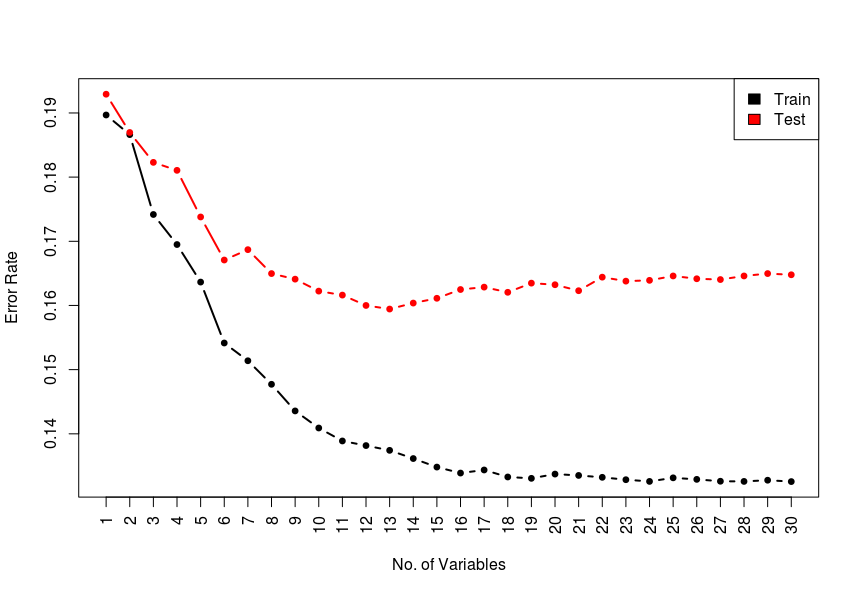
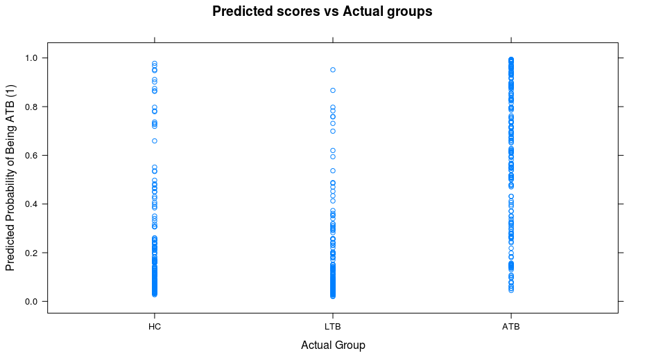
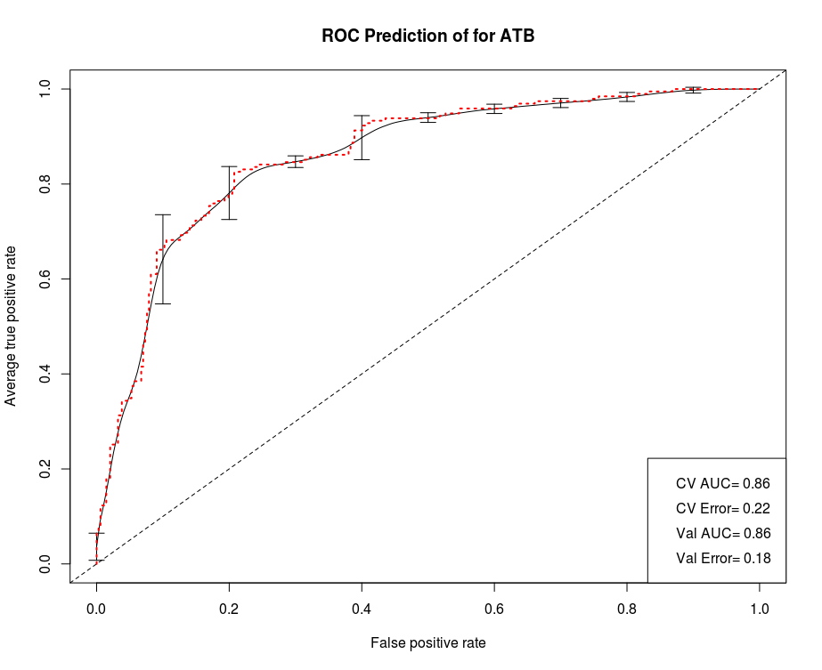
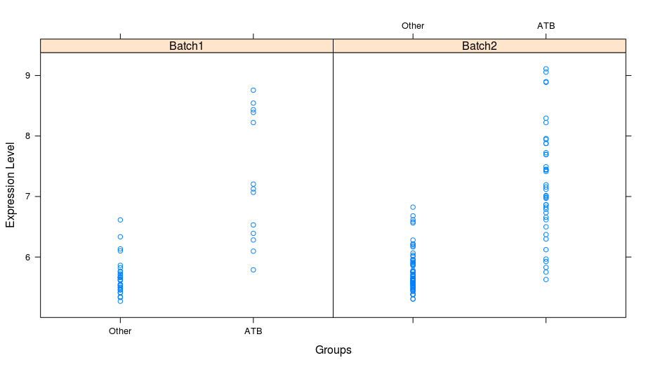
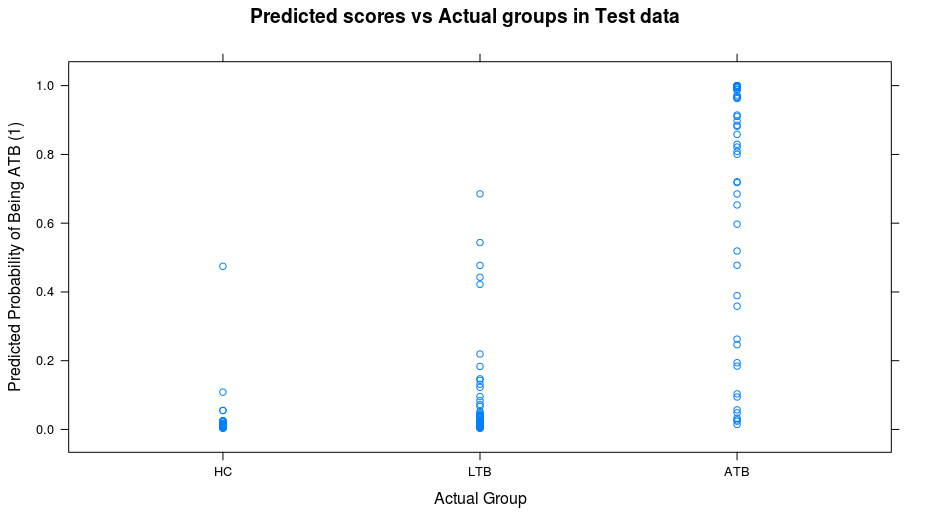

# Tuberculosis Biomarkers  

Discovered in 19th century, [Tuberculosis (TB)](http://www.who.int/tb/en/) is still a serious public health problem and it is estimated that one third of the World’s population is infected with Mycobacterium Tuberculosis (mTB). A biomarker is defined as a characteristic that is objectively measured and evaluated as an indicator of normal or pathological processes, or pharmacologic responses to a therapeutic intervention [(“Biomarkers and Surrogate Endpoints: 2001”)](https://www.ncbi.nlm.nih.gov/pubmed/11240971) which can be used for prediction, diagnosis, staging and monitoring prognosis of a disease. The two data sets we use for this workflow can be found using their NCBI database ids [GSE19491](https://www.ncbi.nlm.nih.gov/geo/query/acc.cgi?acc=GSE19491) and [GSE37250](https://www.ncbi.nlm.nih.gov/geo/query/acc.cgi?acc=GSE37250).  
  
The workflow is organized in steps:  
1. [Training data preparation.](GSE37250.md)
2. [Test data preparation.](GSE19491.md)
3. Workflow for Biomarker Selection.  

  
Our objective here is to train a classifier with the least number of predictors, as this should be a viable and cheap option to implement in a clinical setting. Using classifiers with 30 or more genes will require expensive custom gene panels which eventually is a burden on the healthcare systems of any country.

Some of the material covered here will refer to previous posts (that contain original references to literature) and I will add some references here.

[1] Bishop, C. M. (2006). Pattern Recognition And Machine Learning. Springer. http://doi.org/10.1117/1.2819119

[2] Gelman, A., Carlin, J. B., Stern, H. S., & Rubin, D. B. (2013). Bayesian Data Analysis, Third Edition (Texts in Statistical Science). Book.

[3] James, G., Witten, D., Hastie, T., & Tibshirani, R. (2013). An introduction to statistical learning: with applications in R. Springer texts in statistics (Vol. XIV). http://doi.org/10.1007/978-1-4614-7138-7


The training and test data, prepared in previous steps looks like this:  

```R
> load('results/lData.train.rds')
> str(lData.train)
List of 3
 $ data    : num [1:2000, 1:537] 7.65 8.1 7.78 12.75 11.67 ...
  ..- attr(*, "dimnames")=List of 2
  .. ..$ : chr [1:2000] "GBP6" "SEPT4" "BATF2" "DUSP3" ...
  .. ..$ : chr [1:537] "GSM914353" "GSM914354" "GSM914355" "GSM914356" ...
 $ grouping: Factor w/ 3 levels "HC","LTB","ATB": 3 3 3 3 3 3 3 3 3 3 ...
 $ adjust  : Factor w/ 2 levels "HIV-","HIV+": 1 1 1 1 1 1 1 1 1 1 ...
> 
> load('results/lData.test.rds')
> str(lData.test)
List of 3
 $ data    : num [1:1926, 1:159] 11.56 5.02 7.67 9.34 6.65 ...
  ..- attr(*, "dimnames")=List of 2
  .. ..$ : chr [1:1926] "RPS28" "COL17A1" "TICAM2" "SERTAD2" ...
  .. ..$ : chr [1:159] "GSM484368" "GSM484369" "GSM484370" "GSM484371" ...
 $ grouping: Factor w/ 3 levels "HC","LTB","ATB": 1 1 1 1 1 1 1 1 1 1 ...
 $ batch   : Factor w/ 2 levels "Batch1","Batch2": 2 2 2 2 2 2 2 2 2 2 ...
```

  
We want to be able to classify a subject as belonging to the ATB class when compared with the other classes i.e. Controls and Latent TB. 
```R
> ## merge the HC and LTB groups
> fGroups = rep('ATB', times=length(lData.train$grouping))
> fGroups[lData.train$grouping != 'ATB'] = 'Other'
> fGroups = factor(fGroups, levels = c('Other', 'ATB'))
> table(fGroups, lData.train$grouping)
       
fGroups  HC LTB ATB
  Other 175 167   0
  ATB     0   0 195
```

We have a large number of samples, but the classes are not balanced in this case. If you were looking at a particularly rare disease then having unbalanced classes and small number of samples in the ATB group can be difficult to predict. However we try and consider this in our variable selection protocol and sub-sample equal numbers from class Other and ATB at each boot cycle of the Random Forest classifier.  
  
We use the R class _CVariableSelection_ for this purpose. This is a collection of functions to perform the variable selection steps. We will perform a nested Random Forest step, where we take subsamples with equal class proportions from the full data and calculate the average importance score for each variable. The importance score signifies, how _important_ a variable is as a predictor.

```R
## perform Random Forest based variable selection step
dfData = data.frame(t(lData.train$data))
str(dfData)
> dfData[1:5, 1:5]
             RPS28  COL17A1   TICAM2  SERTAD2  SELENOM
GSM914353 14.02499 8.650916 9.564925 10.93954 7.099521
GSM914354 14.21219 6.814121 8.753426 11.47259 7.792279
GSM914355 14.36910 7.184877 9.397699 11.11281 8.801547
GSM914356 14.29564 7.557542 9.474396 10.45784 7.800821
GSM914357 14.22798 7.740807 9.437311 10.97167 7.752170
## adjust boot.num as desired
set.seed(123) # for replication purposes
oVar.r = CVariableSelection.RandomForest(dfData, fGroups, boot.num = 100, big.warn = F)
save(oVar.r, file='results/oVar.r.rds')
```


**Figure 1** Top 20 Variables ranked on variable importance score by Random Forest. The error bars show the bootstrap standard errors for the average score.  

  
The Figure 1 shows the top variables for prediction of ATB in the training dataset. We also calculate the bootstrap standard error and the [coefficient of variation.](https://en.wikipedia.org/wiki/Coefficient_of_variation) You can use the data accessor function to extract a data table with these statistics.  

```R
# get the variables
dfRF = CVariableSelection.RandomForest.getVariables(oVar.r)
str(dfRF)
head(dfRF)
> head(dfRF)
         ivMean      ivSD         cv         groups group.lab
GBP6   6.819201 0.5781560 0.08478354 [0.0848,0.512]         0
DUSP3  5.090706 0.6298688 0.12372916 [0.0848,0.512]         0
SEPT4  5.059219 0.5573325 0.11016177 [0.0848,0.512]         0
GBP5   5.009618 0.5199444 0.10378923 [0.0848,0.512]         0
BATF2  4.925800 0.5436408 0.11036599 [0.0848,0.512]         0
FCGR1A 4.795432 0.5912132 0.12328675 [0.0848,0.512]         0
``` 
The _group.lab_ variable bins the genes into groups based on the quantiles of the coefficient of variation vector - thus genes in group 0 have the highest means and the smallest standard errors. This information can be plotted in a [coplot](https://www.rdocumentation.org/packages/VRPM/versions/1.2/topics/colplot), where we split the data into these groups and plot the mean and standard deviations.  


  

**Figure 2** The x axis in each panel shows the standard error while the y axis shows the mean importance score for each gene. The panels represent a quantile of the distribution of the coefficient of variation for the genes. The bottom left panel shows the cloud of genes that have the highest average scores and the lowest standard errors.  

The plot in Figure 2 suggests that most of the _good_ predictors are in the first panel and the mean score drops rapidly after that, while the standard error increases. These top predictors can be selected for further selection. Our aim here is to select the minimum number of genes (or predictors) that can predict the class membership of an observation (i.e. is a subject from group Other or ATB).

Our strategy is to compare candidate models of various sizes and combinations, and we wish to find the optimal combination and size from the candidate gene list. For practical purposes we will be using the top 30 genes from the Random Forest step and use an exhaustive subset selection approach.

The criteria for _optimal_ is the predictive accuracy of a model that can be used to evaluate and compare a model against other candidate models (i.e. models with different gene sizes and combinations). The accuracy can be defined using some form of a function, e.g. mean squared error, log-likelihood, log predictive density etc. The data to calculate this predictive accuracy can be recycled (within sample) or external (out of sample i.e. new data) or using cross-validation. Cross-validation can be computationally expensive and awkward in structured models, but simply put, the data are partitioned into training and test sets. The parameters are estimated on the training set while the fit is evaluated on the test set. 

We split our data into training and test sets, fit the model on the training data and evaluate the accuracy on the test data. Typically we can plot the model size vs the prediction error rate for the test and training sets. The training error rate falls rapidly (due to overfitting/overtraining) while the test error rate initially falls but then plateaus and may start to rise. Furthermore, typically as a rule of thumb, in simple linear models the relationship between the number of variables and overfitting is _log(n)_ where _n_ is the number of training data points.  

```R
> log(nrow(dfData))
[1] 6.285998
> 
> # print variable combinations
> for (i in 1:7){
+   cvTopGenes.sub = CVariableSelection.ReduceModel.getMinModel(oVar.sub, i)
+   cat('Variable Count', i, paste(cvTopGenes.sub), '\n')
+ }
Variable Count 1 GBP6 
Variable Count 2 GBP6 KLF2 
Variable Count 3 DUSP3 GBP5 KLF2 
Variable Count 4 DUSP3 GBP5 KLF2 PGA5 
Variable Count 5 DUSP3 GBP5 KLF2 BAG4 PGA5 
Variable Count 6 DUSP3 GBP5 KLF2 BAG4 WARS PGA5 
Variable Count 7 GBP6 DUSP3 GBP5 KLF2 BAG4 WARS PGA5 
```  

  
**Figure 3** Relationship of model size (x axis) to the Prediction accurary (y axis). The black line shows the training error rate while the read line shows the test error rate.  

Sometimes, you may perform an additional filtering by removing colinear predictors or perhaps merging them - as presence of colinearity or multi-colinearity will cause problems ranging from model fitting errors to unstable estimates. We don't deal with this issue during this exercise. A model fit for these 2 class problems will give a prediction score for the an observation to belong to a class Active TB (ATB) or Other – in our case these scores are between 0 and 1 and can be interpreted as probability of having ATB. By default a cutoff of 0.5 is used to classify an observation in either of the 2 categories - which was used in Figure 3 to calculate a prediction error rate.  

  
**Figure 4** The actual class labels (HC= healthy control, LTB = latent TB and ATB = active TB) vs Predicted class probability (ATB or Other=both HC and LTB).  

Figure 4 shows the scores that have been assigned to each observation, which were originally classified as Healthy (HC), Latent TB (LTB) and Active TB (ATB). The closer the score is to 1 the more likely that observation is from the class ATB. This takes us into the realm of decision making where we need to select an optimal cutoff for classification. At which score cutoff we will classify that observation as ATB? The idea is to maximise your benefit for a correct classification while reducing making the wrong choices. Furthermore, this is just one of the criteria for diagnosing TB and this classifier can be used to classify a person as ATB or else it can make a ‘Reject’ decision and the clinician can use other criteria to make a decision on the diagnosis. There is the option for a 3 group classification, e.g. ATB, Other or Reject.  

One method that can be used to guage the performance of the model and select a cutoff is a [receiver operating characteristic curve](https://en.wikipedia.org/wiki/Receiver_operating_characteristic), i.e. ROC curve. We calculate a statistic called Area Under the Curve - which will be a number from 0 to 1, the closer to 1 the better the classifier. Furthermore, we also perform 10 fold cross validation - which will split the training data into 10 parts (fit the model on 9 parts and test the prediction on the remaining part). For this purpose, we use the R class _CCrossValidation.LDA_ and plot the ROC curve.  

  
**Figure 5** ROC curve with nested 10 fold cross validation. The red broken line is the same data without cross validation.  

```R
### plot the score performance
cvTopGenes.sub = CVariableSelection.ReduceModel.getMinModel(oVar.sub, 1)
dfData.train = data.frame(t(lData.train$data))
dfData.train = data.frame(dfData.train[,cvTopGenes.sub])
colnames(dfData.train) = cvTopGenes.sub

oCV = CCrossValidation.LDA(test.dat = dfData.train, train.dat = dfData.train, test.groups = fGroups,
                           train.groups = fGroups, level.predict = 'ATB', boot.num = 500)

plot.cv.performance(oCV)
``` 

Figure 5 shows the false positive rate (Something predicted as ATB, given it actually is Other) vs the true positive rate (something predicted as ATB, given it is actually ATB). If we move the decision boundary (see Figure 4) from 1 and move towards zero, we will start to make correct decisions, but also risk making wrong ones. At some decision level we need to stop, or else risk classifying everyone as ATB, and get a 100% true positive rate and 100% false positive rate. Typically judging from the ROC curve, we can choose a decision point where the curve starts turning sharply.  

```R
fPredict = rep('reject', times=length(ivPredict))
fPredict[ivPredict >= 0.6] = 'ATB'
table(fPredict, fGroups)
        fGroups
fPredict Other ATB
  ATB       26 102
  reject   316  93
```
If we choose a cutoff of 0.6, we can make 102 correct decisions, 26 wrong ones i.e there is ~ 8% chance that a subject may not have ATB if the test comes out positive (26/(26+316) * 100). However we also fail to detect 93 ATB cases, but successfully do not wrongly classify 316 subjects as ATB. Bear in mind, this may be a good enough marker in clinical settings, as it relies only on one gene, and you have clinical data to make a decision.  

Once we have chosen our cutoffs and our marker genes, we can check the performance in an independent data set (also called validation set or test set). This data is from a different cohort. If you recall, the test data contained two batches, that were apparent on the PCA plots - and it appeared that this was due to different RNA extraction kits used. We will first check if this batch variable has any effect on the expression profile of our marker gene.  

  
**Figure 6** Checking if the expression values for the marker gene are different in the two batches, based on different RNA extraction kits.  

Figure 6 suggests that the expression levels in the two batches are comparable and hence we will use this data from both batches in one model to make a prediction about ATB status.   

  
**Figure 7** The actual class labels (HC= healthy control, LTB = latent TB and ATB = active TB) vs Predicted class probability (ATB or Other=both HC and LTB).  

```R
## predict in the test data
fPredict = rep('reject', times=length(ivPredict))
fPredict[ivPredict >= 0.6] = 'ATB'
table(fPredict, fGroups.test)
        fGroups.test
fPredict Other ATB
  ATB        1  37
  reject   104  17
```
If we choose a cutoff of 0.6, we can make 37 correct decisions, 1 wrong one i.e there is ~ 1% chance that a subject may not have ATB if the test comes out positive (1/(1+104) * 100). We also fail to detect 17 ATB cases, but successfully do not wrongly classify 104 subjects as ATB. This marker performs within statistically acceptable ranges as predicted from the training set. How to calculate these expectation rates for the marker performance is not covered here, but interested readers can follow it somewhere [else](https://laplacebayes.wordpress.com/2018/04/18/biomarker-discovery-a-machine-learning-workflow-applied-to-tuberculosis-diagnosis/). 

In this workflow we followed a one gene marker, which was slightly better than the 6 gene model (Figure 3). One can get better classification results by perhaps stratifying the cohort according to certain other criteria, e.g. clinical symptoms or other diagnostic tests. 