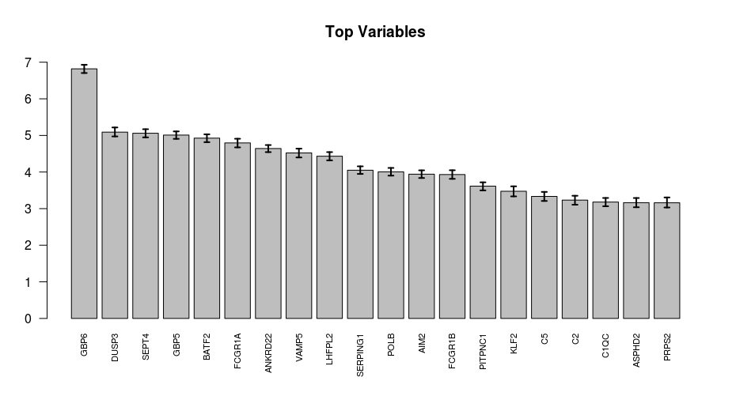
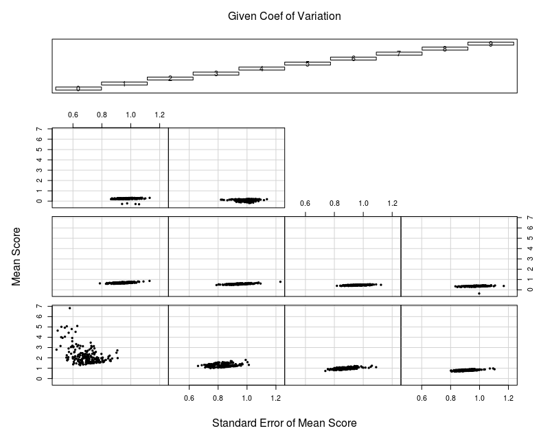

# Tuberculosis Biomarkers  

Discovered in 19th century, [Tuberculosis (TB)](http://www.who.int/tb/en/) is still a serious public health problem and it is estimated that one third of the World’s population is infected with Mycobacterium Tuberculosis (mTB). A biomarker is defined as a characteristic that is objectively measured and evaluated as an indicator of normal or pathological processes, or pharmacologic responses to a therapeutic intervention [(“Biomarkers and Surrogate Endpoints: 2001”)](https://www.ncbi.nlm.nih.gov/pubmed/11240971) which can be used for prediction, diagnosis, staging and monitoring prognosis of a disease. The two data sets we use for this workflow can be found using their NCBI database ids [GSE19491](https://www.ncbi.nlm.nih.gov/geo/query/acc.cgi?acc=GSE19491) and [GSE37250](https://www.ncbi.nlm.nih.gov/geo/query/acc.cgi?acc=GSE37250).  
  
The workflow is organized in steps:  
1. [Training data preparation.](GSE37250.md)
2. [Test data preparation.](GSE19491.md)
3. Workflow for Biomarker Selection.  

  
Our objective here is to train a classifier with the least number of predictors, as this should be a viable and cheap option to implement in a clinical setting. Using classifiers with 30 or more genes will require expensive custom gene panels which eventually is a burden on the healthcare systems of any country.

Some of the material covered here will refer to previous posts (that contain original references to literature) and I will add some references here.

[1] Bishop, C. M. (2006). Pattern Recognition And Machine Learning. Springer. http://doi.org/10.1117/1.2819119

[2] Gelman, A., Carlin, J. B., Stern, H. S., & Rubin, D. B. (2013). Bayesian Data Analysis, Third Edition (Texts in Statistical Science). Book.

[3] James, G., Witten, D., Hastie, T., & Tibshirani, R. (2013). An introduction to statistical learning: with applications in R. Springer texts in statistics (Vol. XIV). http://doi.org/10.1007/978-1-4614-7138-7


The training and test data, prepared in previous steps looks like this:  

```R
> load('results/lData.train.rds')
> str(lData.train)
List of 3
 $ data    : num [1:2000, 1:537] 7.65 8.1 7.78 12.75 11.67 ...
  ..- attr(*, "dimnames")=List of 2
  .. ..$ : chr [1:2000] "GBP6" "SEPT4" "BATF2" "DUSP3" ...
  .. ..$ : chr [1:537] "GSM914353" "GSM914354" "GSM914355" "GSM914356" ...
 $ grouping: Factor w/ 3 levels "HC","LTB","ATB": 3 3 3 3 3 3 3 3 3 3 ...
 $ adjust  : Factor w/ 2 levels "HIV-","HIV+": 1 1 1 1 1 1 1 1 1 1 ...
> 
> load('results/lData.test.rds')
> str(lData.test)
List of 3
 $ data    : num [1:1926, 1:159] 11.56 5.02 7.67 9.34 6.65 ...
  ..- attr(*, "dimnames")=List of 2
  .. ..$ : chr [1:1926] "RPS28" "COL17A1" "TICAM2" "SERTAD2" ...
  .. ..$ : chr [1:159] "GSM484368" "GSM484369" "GSM484370" "GSM484371" ...
 $ grouping: Factor w/ 3 levels "HC","LTB","ATB": 1 1 1 1 1 1 1 1 1 1 ...
 $ batch   : Factor w/ 2 levels "Batch1","Batch2": 2 2 2 2 2 2 2 2 2 2 ...
```

  
We want to be able to classify a subject as belonging to the ATB class when compared with the other classes i.e. Controls and Latent TB. 
```R
> ## merge the HC and LTB groups
> fGroups = rep('ATB', times=length(lData.train$grouping))
> fGroups[lData.train$grouping != 'ATB'] = 'Other'
> fGroups = factor(fGroups, levels = c('Other', 'ATB'))
> table(fGroups, lData.train$grouping)
       
fGroups  HC LTB ATB
  Other 175 167   0
  ATB     0   0 195
```

We have a large number of samples, but the classes are not balanced in this case. If you were looking at a particularly rare disease then having unbalanced classes and small number of samples in the ATB group can be difficult to predict. However we try and consider this in our variable selection protocol and sub-sample equal numbers from class Other and ATB at each boot cycle of the Random Forest classifier.  
  
We use the R class _CVariableSelection_ for this purpose. This is a collection of functions to perform the variable selection steps. We will perform a nested Random Forest step, where we take subsamples with equal class proportions from the full data and calculate the average importance score for each variable. The importance score signifies, how _important_ a variable is as a predictor.

```R
## perform Random Forest based variable selection step
dfData = data.frame(t(lData.train$data))
str(dfData)
> dfData[1:5, 1:5]
             RPS28  COL17A1   TICAM2  SERTAD2  SELENOM
GSM914353 14.02499 8.650916 9.564925 10.93954 7.099521
GSM914354 14.21219 6.814121 8.753426 11.47259 7.792279
GSM914355 14.36910 7.184877 9.397699 11.11281 8.801547
GSM914356 14.29564 7.557542 9.474396 10.45784 7.800821
GSM914357 14.22798 7.740807 9.437311 10.97167 7.752170
## adjust boot.num as desired
set.seed(123) # for replication purposes
oVar.r = CVariableSelection.RandomForest(dfData, fGroups, boot.num = 100, big.warn = F)
save(oVar.r, file='results/oVar.r.rds')
```


**Figure 1** Top 20 Variables ranked on variable importance score by Random Forest. The error bars show the bootstrap standard errors for the average score.  

  
The Figure 1 shows the top variables for prediction of ATB in the training dataset. We also calculate the bootstrap standard error and the [coefficient of variation.](https://en.wikipedia.org/wiki/Coefficient_of_variation) You can use the data accessor function to extract a data table with these statistics.  

```R
# get the variables
dfRF = CVariableSelection.RandomForest.getVariables(oVar.r)
str(dfRF)
head(dfRF)
> head(dfRF)
         ivMean      ivSD         cv         groups group.lab
GBP6   6.819201 0.5781560 0.08478354 [0.0848,0.512]         0
DUSP3  5.090706 0.6298688 0.12372916 [0.0848,0.512]         0
SEPT4  5.059219 0.5573325 0.11016177 [0.0848,0.512]         0
GBP5   5.009618 0.5199444 0.10378923 [0.0848,0.512]         0
BATF2  4.925800 0.5436408 0.11036599 [0.0848,0.512]         0
FCGR1A 4.795432 0.5912132 0.12328675 [0.0848,0.512]         0
``` 
The _group.lab_ variable bins the genes into groups based on the coefficient of variation - thus genes in group 0 have the highest means and the smallest standard errors. This information can be plotted in a [coplot](https://www.rdocumentation.org/packages/VRPM/versions/1.2/topics/colplot), where we split the data into these groups and plot the mean and standard deviations.  



**Figure 2** The x axis in each panel shows the standard error while the y axis shows the mean importance score for each genes. Each panel represents a quantile of the distribution of the coefficient of variation for the genes. The bottom left panel shows the cloud of genes that have the highest average scores and the lowest standard errors.  

The plot in Figure 2 suggests that most of the _good_ predictors are in the first panel and the score drops rapidly after that. These top predictors can be selected for further selection.   